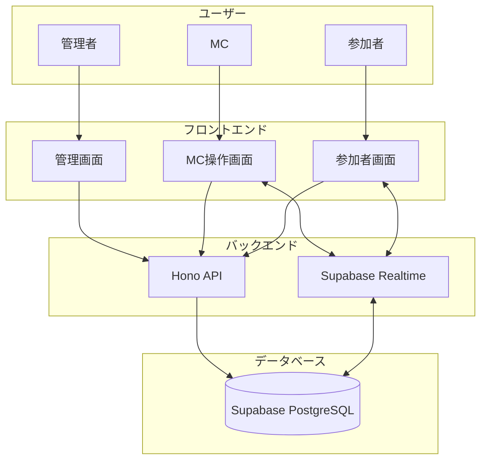
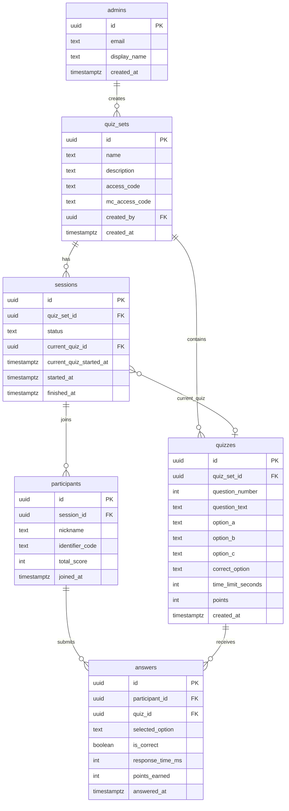
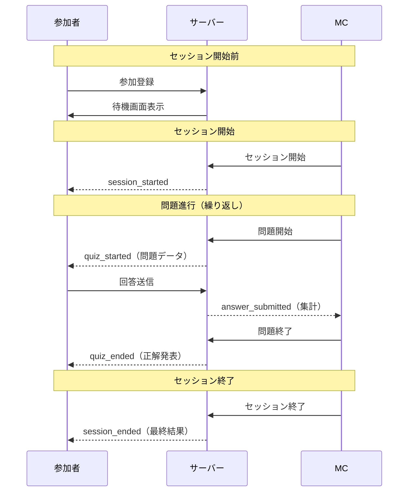
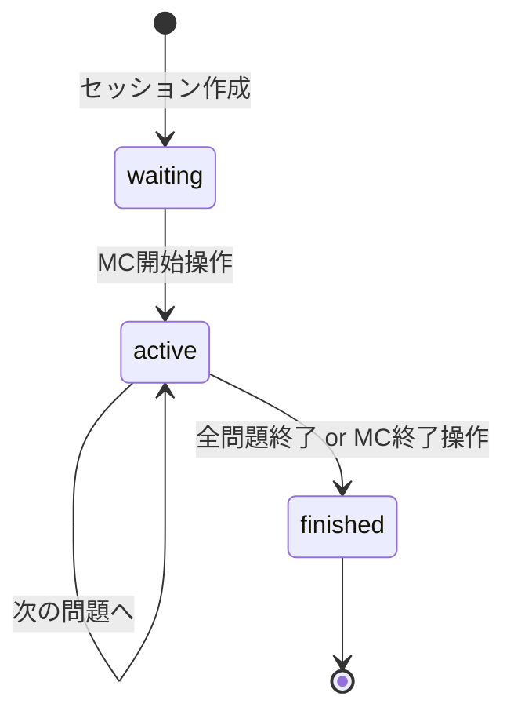

# 技術設計書

## 1. システムアーキテクチャ

### 1.1 全体構成



### 1.2 技術スタック

| カテゴリ               | 技術                  |
| ---------------------- | --------------------- |
| フレームワーク         | Hono + Honox          |
| クライアントUI         | Preact                |
| バリデーション         | Zod                   |
| ORM                    | Drizzle ORM           |
| ビルドツール           | Vite                  |
| スタイリング           | Tailwind CSS v4       |
| データベース           | Supabase (PostgreSQL) |
| 認証                   | Supabase Auth         |
| リアルタイム           | Supabase Realtime     |
| デプロイ               | Vercel                |
| パッケージマネージャー | Bun                   |
| コード品質             | Biome                 |

---

## 2. ディレクトリ構成

参考: [ZOZOTOWNのフロントエンドディレクトリ設計](https://techblog.zozo.com/entry/zozotown-frontend-directory-design)

```
wedinq_example/
├── app/
│   ├── client.ts                 # クライアントエントリポイント
│   ├── server.ts                 # サーバーエントリポイント
│   ├── global.d.ts               # グローバル型定義
│   ├── style.css                 # Tailwind CSS
│   │
│   ├── components/               # コンポーネント層
│   │   ├── UI/                   # 汎用UIコンポーネント
│   │   │   ├── Button/
│   │   │   ├── Input/
│   │   │   ├── Card/
│   │   │   ├── Modal/
│   │   │   └── Timer/
│   │   ├── Models/               # ドメインロジックを含むコンポーネント
│   │   │   ├── QuizCard/
│   │   │   ├── ParticipantList/
│   │   │   ├── ScoreBoard/
│   │   │   └── AnswerOption/
│   │   ├── Layouts/              # レイアウトコンポーネント
│   │   │   ├── AppLayout/
│   │   │   ├── AdminLayout/
│   │   │   └── McLayout/
│   │   └── Functional/           # UIを伴わない機能コンポーネント
│   │       ├── RealtimeProvider/
│   │       ├── AuthProvider/
│   │       └── SessionProvider/
│   │
│   ├── islands/                  # Preactインタラクティブコンポーネント
│   │   ├── QuizPlayer/           # クイズ回答UI
│   │   ├── McController/         # MC操作パネル
│   │   ├── LiveResults/          # リアルタイム結果表示
│   │   └── Countdown/            # カウントダウンタイマー
│   │
│   ├── db/                       # データベース関連
│   │   ├── index.ts              # Drizzleクライアント
│   │   ├── schema.ts             # Drizzleスキーマ定義
│   │   └── relations.ts          # リレーション定義
│   │
│   ├── lib/                      # ユーティリティ・ヘルパー
│   │   ├── supabase.ts           # Supabaseクライアント（Auth/Realtime用）
│   │   ├── auth.ts               # 認証ヘルパー
│   │   ├── scoring.ts            # スコア計算ロジック
│   │   └── realtime.ts           # Realtimeイベント管理
│   │
│   ├── hooks/                    # カスタムフック
│   │   ├── useSession.ts
│   │   ├── useRealtime.ts
│   │   └── useCountdown.ts
│   │
│   ├── schemas/                  # Zodスキーマ・型定義
│   │   ├── quiz.ts
│   │   ├── session.ts
│   │   ├── participant.ts
│   │   └── api.ts
│   │
│   └── routes/                   # ファイルベースルーティング
│       ├── index.tsx             # トップページ
│       ├── _renderer.tsx         # レイアウト
│       ├── _error.tsx            # エラーハンドリング
│       ├── _404.tsx              # 404ページ
│       ├── join.tsx              # 参加登録
│       ├── api/                  # APIエンドポイント
│       │   ├── auth/
│       │   ├── quiz-sets/
│       │   ├── sessions/
│       │   └── answers/
│       ├── admin/                # 管理者画面
│       │   ├── index.tsx
│       │   ├── login.tsx
│       │   └── quiz-sets/
│       ├── mc/                   # MC画面
│       │   ├── auth.tsx
│       │   ├── dashboard.tsx
│       │   ├── status.tsx
│       │   └── results.tsx
│       └── play/                 # 参加者画面
│           ├── waiting.tsx
│           ├── quiz.tsx
│           └── final.tsx
│
├── docs/
│   ├── requirements.md           # 要件定義書
│   └── tech_design.md            # 技術設計書（本ファイル）
├── public/                       # 静的ファイル
├── drizzle/                      # Drizzleマイグレーション
│   └── migrations/               # 生成されたSQLファイル
├── drizzle.config.ts             # Drizzle設定
├── package.json
├── tsconfig.json
├── vite.config.ts
├── vercel.json
└── biome.json
```

### 2.1 コンポーネント分類ルール

| ディレクトリ | 役割 | 依存可能な層 |
| ------------ | ---- | ------------ |
| **UI** | 汎用的なUI部品。ドメイン知識を持たない | Functional |
| **Models** | ドメインロジックを含む。複数ページで使用 | UI, Functional |
| **Layouts** | ページ全体のレイアウト構造 | UI, Functional |
| **Functional** | UIを伴わない機能（Provider等） | なし |

### 2.2 コンポーネント分類フロー

```
新しいコンポーネント作成時の判断基準:

1. UIを伴わない機能か？ → Functional
2. アプリ全体のレイアウトか？ → Layouts
3. ドメインロジックを含み、複数ページで使用か？ → Models
4. 上記以外の汎用UI → UI
```

### 2.3 islands（Preact）の使用基準

Honoxの `islands/` はクライアントサイドでハイドレーションが必要なコンポーネントに使用:

- リアルタイム更新が必要なUI
- ユーザーインタラクションが多いUI
- タイマーやアニメーションを含むUI

**例:**
- `QuizPlayer` - 回答選択、タイマー表示
- `McController` - セッション操作ボタン
- `LiveResults` - リアルタイム集計表示
- `Countdown` - カウントダウンアニメーション

---

## 3. データベース設計

### 3.1 ER図



### 3.2 テーブル定義

#### admins

管理者情報。Supabase Auth の `auth.users` と連携。

| カラム       | 型          | 制約        | 説明                 |
| ------------ | ----------- | ----------- | -------------------- |
| id           | uuid        | PK          | auth.users.id を参照 |
| email        | text        | NOT NULL    | メールアドレス       |
| display_name | text        | NOT NULL    | 表示名               |
| created_at   | timestamptz | DEFAULT now | 作成日時             |

#### quiz_sets

クイズセット。1つのイベント（結婚式）に対応。

| カラム         | 型          | 制約             | 説明                    |
| -------------- | ----------- | ---------------- | ----------------------- |
| id             | uuid        | PK, DEFAULT uuid | クイズセットID          |
| name           | text        | NOT NULL         | セット名                |
| description    | text        |                  | 説明                    |
| access_code    | text        | UNIQUE, NOT NULL | 参加者用コード（6文字） |
| mc_access_code | text        | UNIQUE, NOT NULL | MC用コード（8文字）     |
| created_by     | uuid        | FK -> admins.id  | 作成者                  |
| created_at     | timestamptz | DEFAULT now      | 作成日時                |

#### quizzes

クイズ問題。

| カラム             | 型          | 制約                 | 説明                   |
| ------------------ | ----------- | -------------------- | ---------------------- |
| id                 | uuid        | PK, DEFAULT uuid     | 問題ID                 |
| quiz_set_id        | uuid        | FK -> quiz_sets.id   | 所属セット             |
| question_number    | int         | NOT NULL             | 問題番号               |
| question_text      | text        | NOT NULL             | 問題文                 |
| option_a           | text        | NOT NULL             | 選択肢A                |
| option_b           | text        | NOT NULL             | 選択肢B                |
| option_c           | text        | NOT NULL             | 選択肢C                |
| correct_option     | text        | NOT NULL, CHECK      | 正解（A/B/C）          |
| time_limit_seconds | int         | DEFAULT 30           | 制限時間（10〜60秒）   |
| points             | int         | DEFAULT 100          | 基本ポイント           |
| created_at         | timestamptz | DEFAULT now          | 作成日時               |

#### sessions

クイズセッション。

| カラム                  | 型          | 制約                 | 説明                            |
| ----------------------- | ----------- | -------------------- | ------------------------------- |
| id                      | uuid        | PK, DEFAULT uuid     | セッションID                    |
| quiz_set_id             | uuid        | FK -> quiz_sets.id   | 対象クイズセット                |
| status                  | text        | NOT NULL, DEFAULT 'waiting', CHECK (status IN ('waiting', 'active', 'finished')) | 状態 |
| current_quiz_id         | uuid        | FK -> quizzes.id     | 現在の問題                      |
| current_quiz_started_at | timestamptz |                      | 現在の問題開始時刻              |
| started_at              | timestamptz |                      | セッション開始時刻              |
| finished_at             | timestamptz |                      | セッション終了時刻              |

#### participants

参加者。

| カラム          | 型          | 制約               | 説明           |
| --------------- | ----------- | ------------------ | -------------- |
| id              | uuid        | PK, DEFAULT uuid   | 参加者ID       |
| session_id      | uuid        | FK -> sessions.id  | 参加セッション |
| nickname        | text        | NOT NULL           | ニックネーム   |
| identifier_code | text        | NOT NULL           | 識別コード     |
| total_score     | int         | DEFAULT 0          | 累計スコア     |
| joined_at       | timestamptz | DEFAULT now        | 参加日時       |

**UNIQUE制約**: (session_id, identifier_code)

#### answers

回答。

| カラム           | 型          | 制約                 | 説明               |
| ---------------- | ----------- | -------------------- | ------------------ |
| id               | uuid        | PK, DEFAULT uuid     | 回答ID             |
| participant_id   | uuid        | FK -> participants   | 回答者             |
| quiz_id          | uuid        | FK -> quizzes.id     | 対象問題           |
| selected_option  | text        | NOT NULL, CHECK      | 選択肢（A/B/C）    |
| is_correct       | boolean     | NOT NULL             | 正解フラグ         |
| response_time_ms | int         | NOT NULL             | 回答時間（ミリ秒） |
| points_earned    | int         | NOT NULL             | 獲得ポイント       |
| answered_at      | timestamptz | DEFAULT now          | 回答日時           |

**UNIQUE制約**: (participant_id, quiz_id)

### 3.3 Drizzleスキーマ

`app/db/schema.ts` にDrizzle ORMのスキーマを定義。テーブル定義に基づきマイグレーションを自動生成。

| ファイル | 役割 |
| -------- | ---- |
| `app/db/schema.ts` | テーブル定義 |
| `app/db/relations.ts` | リレーション定義 |
| `app/db/index.ts` | Drizzleクライアント |
| `drizzle.config.ts` | Drizzle設定 |

### 3.4 RLS（Row Level Security）ポリシー

| テーブル     | 操作                 | ポリシー                                          |
| ------------ | -------------------- | ------------------------------------------------- |
| admins       | SELECT               | 自分のレコードのみ                                |
| quiz_sets    | ALL                  | created_by が自分のもののみ                       |
| quizzes      | SELECT               | quiz_set の created_by が自分 or 公開セッション   |
| quizzes      | INSERT/UPDATE/DELETE | quiz_set の created_by が自分                     |
| sessions     | SELECT               | 参加中 or 作成者                                  |
| participants | SELECT               | 自分 or セッション作成者                          |
| answers      | SELECT               | 自分の回答 or MC                                  |
| answers      | INSERT               | 参加中のセッションのみ                            |

---

## 4. API設計

### 4.1 エンドポイント一覧

#### 認証

| メソッド | パス                  | 説明           | 認証   |
| -------- | --------------------- | -------------- | ------ |
| POST     | /api/auth/login       | 管理者ログイン | なし   |
| POST     | /api/auth/logout      | ログアウト     | 管理者 |
| POST     | /api/auth/mc          | MC認証         | なし   |
| POST     | /api/auth/participant | 参加者登録     | なし   |

#### クイズセット

| メソッド | パス                     | 説明         | 認証   |
| -------- | ------------------------ | ------------ | ------ |
| GET      | /api/quiz-sets           | 一覧取得     | 管理者 |
| POST     | /api/quiz-sets           | 作成         | 管理者 |
| GET      | /api/quiz-sets/:id       | 詳細取得     | 管理者 |
| PUT      | /api/quiz-sets/:id       | 更新         | 管理者 |
| DELETE   | /api/quiz-sets/:id       | 削除         | 管理者 |
| POST     | /api/quiz-sets/:id/codes | コード再発行 | 管理者 |

#### クイズ問題

| メソッド | パス                             | 説明         | 認証      |
| -------- | -------------------------------- | ------------ | --------- |
| GET      | /api/quiz-sets/:id/quizzes       | 問題一覧取得 | 管理者/MC |
| POST     | /api/quiz-sets/:id/quizzes       | 問題追加     | 管理者    |
| PUT      | /api/quizzes/:id                 | 問題更新     | 管理者    |
| DELETE   | /api/quizzes/:id                 | 問題削除     | 管理者    |
| PUT      | /api/quiz-sets/:id/quizzes/order | 並び替え     | 管理者    |

#### セッション

| メソッド | パス                           | 説明             | 認証      |
| -------- | ------------------------------ | ---------------- | --------- |
| POST     | /api/sessions                  | セッション作成   | MC        |
| GET      | /api/sessions/:id              | セッション取得   | MC/参加者 |
| POST     | /api/sessions/:id/start        | セッション開始   | MC        |
| POST     | /api/sessions/:id/next         | 次の問題へ       | MC        |
| POST     | /api/sessions/:id/end-quiz     | 問題終了         | MC        |
| POST     | /api/sessions/:id/finish       | セッション終了   | MC        |
| GET      | /api/sessions/:id/participants | 参加者一覧       | MC        |
| GET      | /api/sessions/:id/results      | 結果取得         | MC/参加者 |

#### 回答

| メソッド | パス                         | 説明           | 認証   |
| -------- | ---------------------------- | -------------- | ------ |
| POST     | /api/sessions/:id/answer     | 回答送信       | 参加者 |
| GET      | /api/sessions/:id/my-answers | 自分の回答取得 | 参加者 |

### 4.2 レスポンス形式

```typescript
// 成功レスポンス
interface SuccessResponse<T> {
  success: true;
  data: T;
}

// エラーレスポンス
interface ErrorResponse {
  success: false;
  error: {
    code: string;
    message: string;
  };
}
```

### 4.3 バリデーションスキーマ（Zod）

`app/schemas/` にZodスキーマを定義し、APIリクエストのバリデーションと型生成に使用。

| スキーマ | 用途 | 主なバリデーション |
| -------- | ---- | ------------------ |
| `accessCodeSchema` | 参加者用コード | 6文字、英数字大文字 |
| `mcAccessCodeSchema` | MC用コード | 8文字、英数字大文字 |
| `optionSchema` | 選択肢 | A / B / C |
| `loginSchema` | 管理者ログイン | email, password(8文字以上) |
| `participantJoinSchema` | 参加者登録 | accessCode, identifierCode, nickname |
| `createQuizSetSchema` | クイズセット作成 | name(1-100文字), description(任意) |
| `createQuizSchema` | 問題作成 | questionText, options, correctOption, timeLimit(10-60), points |
| `submitAnswerSchema` | 回答送信 | quizId, selectedOption, responseTimeMs |

※ 型は `z.infer<typeof schema>` で自動生成

---

## 5. リアルタイム同期

### 5.1 Supabase Realtime チャンネル

チャンネル名: `session:{session_id}`

### 5.2 イベント定義

| イベント         | 送信元 | 受信先 | ペイロード                                                     |
| ---------------- | ------ | ------ | -------------------------------------------------------------- |
| session_started  | MC     | 参加者 | `{ sessionId }`                                                |
| quiz_started     | MC     | 参加者 | `{ quizId, questionNumber, questionText, options, timeLimit }` |
| quiz_ended       | MC     | 参加者 | `{ quizId, correctOption, yourAnswer?, yourScore? }`           |
| answer_submitted | 参加者 | MC     | `{ participantId, quizId, option }` ※集計用                    |
| session_ended    | MC     | 参加者 | `{ rankings }` ※上位3名                                        |

### 5.3 シーケンス図



---

## 6. スコア計算ロジック

### 6.1 計算式

```typescript
function calculateScore(
  isCorrect: boolean,
  responseTimeMs: number,
  timeLimitSeconds: number,
  basePoints: number = 100
): number {
  if (!isCorrect) return 0;

  const timeLimitMs = timeLimitSeconds * 1000;
  const ratio = Math.min(Math.max(responseTimeMs / timeLimitMs, 0), 1);
  const multiplier = 1.5 - 0.5 * ratio;

  return Math.floor(basePoints * multiplier);
}
```

### 6.2 スコア例

| 回答タイミング     | ratio | 倍率   | 100点基準 |
| ------------------ | ----- | ------ | --------- |
| 即答（0秒）        | 0.0   | 1.5倍  | 150点     |
| 半分経過           | 0.5   | 1.25倍 | 125点     |
| 制限時間ギリギリ   | 1.0   | 1.0倍  | 100点     |

---

## 7. 認証・認可

### 7.1 認証方式

| ロール | 認証方式                            | 有効期間       |
| ------ | ----------------------------------- | -------------- |
| 管理者 | Supabase Auth（メール+パスワード）  | セッション依存 |
| MC     | アクセスコード（8文字）             | セッション中   |
| 参加者 | アクセスコード（6文字）+ 識別コード | セッション中   |

### 7.2 アクセスコード生成

```typescript
// 参加者用（6文字、英数字大文字）
function generateAccessCode(): string {
  const chars = 'ABCDEFGHJKLMNPQRSTUVWXYZ23456789'; // 紛らわしい文字を除外
  return Array.from({ length: 6 }, () =>
    chars[Math.floor(Math.random() * chars.length)]
  ).join('');
}

// MC用（8文字、英数字大文字）
function generateMcAccessCode(): string {
  const chars = 'ABCDEFGHJKLMNPQRSTUVWXYZ23456789';
  return Array.from({ length: 8 }, () =>
    chars[Math.floor(Math.random() * chars.length)]
  ).join('');
}
```

---

## 8. セッション状態管理

### 8.1 状態遷移図



### 8.2 状態定義

| 状態     | 説明             | 許可される操作                       |
| -------- | ---------------- | ------------------------------------ |
| waiting  | 参加者待ち受け中 | 参加登録、セッション開始             |
| active   | クイズ進行中     | 回答送信、次の問題、セッション終了   |
| finished | 終了             | 結果確認のみ                         |

---

## 9. 画面設計

### 9.1 画面一覧

#### 共通

| 画面名       | パス | 説明                             |
| ------------ | ---- | -------------------------------- |
| トップページ | `/`  | ロール選択（参加者/MC/管理者）   |

#### 参加者向け

| 画面名     | パス            | 説明                         |
| ---------- | --------------- | ---------------------------- |
| 参加登録   | `/join`         | コード入力・ニックネーム登録 |
| 待機画面   | `/play/waiting` | セッション開始待ち           |
| クイズ画面 | `/play/quiz`    | 問題表示・回答選択           |
| 結果画面   | `/play/final`   | 最終結果表示                 |

#### MC向け

| 画面名         | パス            | 説明                   |
| -------------- | --------------- | ---------------------- |
| MC認証         | `/mc/auth`      | アクセスコード入力     |
| ダッシュボード | `/mc/dashboard` | セッション作成・進行管理 |
| 回答状況       | `/mc/status`    | リアルタイム回答状況   |
| 結果確認       | `/mc/results`   | 上位3名・詳細結果      |

#### 管理者向け

| 画面名         | パス                            | 説明             |
| -------------- | ------------------------------- | ---------------- |
| ログイン       | `/admin/login`                  | 認証画面         |
| ダッシュボード | `/admin`                        | クイズセット一覧 |
| セット作成     | `/admin/quiz-sets/new`          | 新規作成         |
| セット編集     | `/admin/quiz-sets/[id]`         | 編集             |
| 問題管理       | `/admin/quiz-sets/[id]/quizzes` | 問題CRUD         |

---

## 10. 非機能要件

### 10.1 パフォーマンス

- 同時接続数: 最大100名
- リアルタイム遅延: 1秒以内

### 10.2 対応デバイス

- スマートフォン（主要対象）
- タブレット
- PC

### 10.3 対応ブラウザ

- Chrome（最新版）
- Safari（最新版）

### 10.4 セキュリティ

- 管理者認証: Supabase Auth（メール+パスワード）
- MC認証: 8文字アクセスコード
- 参加者認証: 6文字アクセスコード + 識別コード
- RLS（Row Level Security）によるデータアクセス制御
